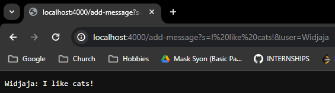

# Lab Report 2  
<a href="https://ucsd-cse15l-w24.github.io/week3/index.html#lab-report-2---servers-and-ssh-keys-week-3" target="_blank">INSTRUCTIONS TO THIS LAB</a>

# Part 1 - Chat Server  
In this lab (lab report 2), we build a chat server that is be able to take in a url and detect if that path contains *"/add-message"* followed by a query that is formatted as such: `?s=<string>&user=<string>`. This will concatenate the message to a String containing the name of the user followed by the user's message in the form: `<user>: <message>`. This will print to the page when the url contains *"/add-message"*.  
<br>

## Code block for the Chat Server:
```java
import java.io.IOException;
import java.net.URI;

class Handler implements URLHandler {
    private static final int MESSAGE_START_IND = 2;
    private static final int USER_START_IND = 5;
    private static final String NEWLINE = "\n";
    private static final String COLON_MESSAGE = ": ";
    private static final String ERROR_URL = "404 not found!";

    String chat = "";

    public String handleRequest(URI url) {
        if (url.getPath().contains("/add-message")) {
            if (url.getQuery() == null) {
                return String.format(chat);
            }

            String[] query = url.getQuery().split("&");
            String message = query[0].substring(MESSAGE_START_IND);
            String user = query[1].substring(USER_START_IND);
            
            this.chat += user + COLON_MESSAGE + message + NEWLINE;
            
            return String.format(chat);
        }
        return String.format(ERROR_URL);
    }
}

class ChatServer {
    public static void main(String[] args) throws IOException {
        if(args.length == 0){
            System.out.println("Missing port number! Try any number between 1024 to 49151");
            return;
        }

        int port = Integer.parseInt(args[0]);

        Server.start(port, new Handler());
    }
}
```  
<br>

## Two screenshots using "/add-message":
**Screenshot 1:** <br>


> Which methods in the code are called?  

```java
url.getPath(), .contains(), url.getQuery(), .split(), 
.substring(), String.format(), Integer.parseInt(), 
Server.start(), the main() method, 
and the handleRequest() method
```

> What are the relevant arguments to those methods, and the values of any relevant fields of the class?  

`String chat = "";`  
The chat object is initialized as empty everytime the server is booted up, however this may change depending on the user input in the url of the page.  

`.split("&")`  
The split method splits a *String* object into a *String[]* array.  

`.substring(MESSAGE_START_IND)`  
Using the *private static final* variable `MESSAGE_START_IND = 2`, grab a substring to the first part of the query that will be the user's message.  

`.substring(USER_START_IND)`  
Using the *private static final* variable `USER_START_IND = 5`, grab a substring to the second part of the query that will be the user's name.  
<br>

> How do the values of any relevant fields of the class change from this specific request?  

The *chat String* field of the class changed from this request to *"Widjaja: I like cats!"* The other fields did not change because they are *static final* variables. I entered in the URL as `"http://localhost:4000/add-message?s=I like cats!&user=Widjaja"` but it changed to `"http://localhost:4000/add-message?s=I%20like%20cats!&user=Widjaja"` to account for the spaces. When the query changes for */add-message/?s=<string>&user=<string>*, the url *URI* object that is passed into *handleRequest()* also changes to reflect the contents of the url.  
<br>  

---

**Screenshot 2:** <br>


> Which methods in this code are called?  

```java
url.getPath(), .contains(), url.getQuery(), String.format(), 
Integer.parseInt(), Server.start(), the main() method, 
and the handleRequest() methodmethod
```

> What are the relevant arguments to those methods, and the values of any relevant fields of the class?  

`String chat = "";`  
In this instance, whatever has been concatenated to *chat* while the server has been running will print out onto the screen.  
<br>

> How do the values of any relevant fields of the class change from this specific request?  

The *chat String* field did not change from this request to the *"/add-message"* page, and neither did the other fields change because they are *static final* variables. The url did not change either as the intended (and actual) output is to simply print the *chat String*.  

---

### Methods that are called similarly between *"/add-message"* calls  

`.contains("/add-message")`  
The contains method searches a *String* object for the argument *"/add-message"*.  

`String.format(chat)`  
`String.format(ERROR_URL)`  
The format method is a *static* class called on *String* which returns a formatted *String*. *chat* is the chatlog stored on the server, while *ERROR_URL* is a string to be used to handle cases with invalid urls.  

`Integer.parseInt(args[0])`  
This method parses the first argument passed to *CheckServer.java* as the port number to start the server.  

`Server.start(port, new Handler())`  
This method starts the server with port that was parsed as an *Integer* and instantiates a *new Handler()* to start the server.  

`main(String[] args)`  
The main method that is run when running *ChatServer.java*.  

`handleRequest(URI url)`  
The *handleRequest()* method handles the requests that are inputted by the user into the url and everytime the page is loaded, this method gets called.  

`MESSAGE_START_IND = 2; USER_START_IND = 5; NEWLINE = "\n"; COLON_MESSAGE = ": "; ERROR_URL = "404 not found!";`  
These are all *private static final* variables that are not meant to be changed but are meant to be used in the code as a way to avoid using "Magic Numbers" for proper Java style convention.  

# Part 2 - SSH  
In this part of the lab, we use the **ls** command in a terminal to demonstrate our usage and understanding of SSH.

> The absolute path to the private key for my SSH key for logging into ieng6 **(on my computer)**.  <br>
C:/Users/Widjaja/.ssh/id_rsa  

  
<br>

> The absolute path to the public key for my SSH key for logging into ieng6 **(on ieng6)**.  <br>
/home/linux/ieng6/oce/9f/wiwidjaja/.ssh/authorized_keys  

  
<br>

> A terminal interaction where I log into my ieng6 account without being asked for a password **(on my computer)**.  <br>


<br>

# Part 3 - Something I Did Not Know...  
Something that I learned from lab in week 2 that I did not know before was: **"What the heck is a secure shell?"**  
I have used a secure shell in a hackathon in the past, but I was not aware that what I was using at the time was a secure shell. The usefulness of the tool was also made aware to me from the week 2 lab where each member of the class logged into what I assume to be a partition on the UCSD servers remotely. This week's lab from week 3 further solidified my initial curiousities about the use cases for a secure shell, and it seems very useful for accessing other systems across networks for something like remote development for example. 

# Part 4 - Jambo The Cat

