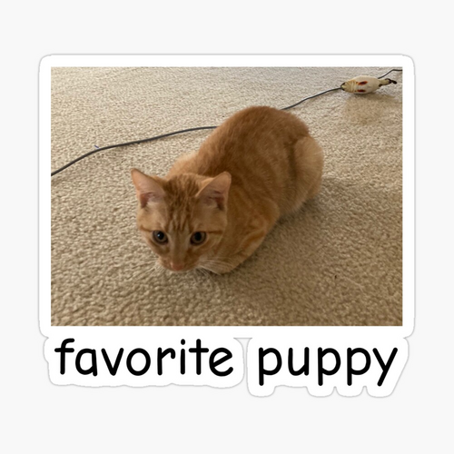

# Lab Report 2  
<a href="https://ucsd-cse15l-w24.github.io/week3/index.html#lab-report-2---servers-and-ssh-keys-week-3" target="_blank">INSTRUCTIONS TO THIS LAB</a>

# Part 1 - Chat Server  
In this lab (lab report 2), we build a chat server that is be able to take in a url and detect if that path contains "/add-message" followed by a query that is formatted as such: `?s=<string>&user=<string>`. This will concatenate the message to a String containing the name of the user followed by the user's message in the form: `<user>: <message>`. This will print to the page when the url contains "/add-message".  
<br>

## Code block for the Chat Server:
```java
import java.io.IOException;
import java.net.URI;

class Handler implements URLHandler {
    private static final int MESSAGE_START_IND = 2;
    private static final int USER_START_IND = 5;
    private static final String NEWLINE = "\n";
    private static final String COLON_MESSAGE = ": ";
    private static final String ERROR_URL = "404 not found!";

    String chat = "";

    public String handleRequest(URI url) {
        if (url.getPath().contains("/add-message")) {
            if (url.getQuery() == null) {
                return String.format(chat);
            }

            String[] query = url.getQuery().split("&");
            String user = query[1].substring(USER_START_IND);
            String message = query[0].substring(MESSAGE_START_IND);
            
            this.chat += user + COLON_MESSAGE + message + NEWLINE;
            
            return String.format(chat);
        }
        return String.format(ERROR_URL);
    }
}

class ChatServer {
    public static void main(String[] args) throws IOException {
        if(args.length == 0){
            System.out.println("Missing port number! Try any number between 1024 to 49151");
            return;
        }

        int port = Integer.parseInt(args[0]);

        Server.start(port, new Handler());
    }
}
```  
<br>

## Two screenshots using "/add-message":
`Screenshot 1:` <br>


Which methods in your code are called?


What are the relevant arguments to those methods, and the values of any relevant fields of the class?


How do the values of any relevant fields of the class change from this specific request? If no values got changed, explain why. By values, we mean specific Strings, ints, URIs, and so on. "abc" is a value, 456 is a value, new URI("http://...") is a value, and so on.  
END TEXT  
<br>

`Screenshot 2:` <br>


Which methods in your code are called?


What are the relevant arguments to those methods, and the values of any relevant fields of the class?


How do the values of any relevant fields of the class change from this specific request? If no values got changed, explain why. By values, we mean specific Strings, ints, URIs, and so on. "abc" is a value, 456 is a value, new URI("http://...") is a value, and so on.  
END TEXT  
<br>

# Part 2 - SSH  
In this part of the lab, we use the **ls** command in a terminal to demonstrate our usage and understanding of SSH.

> The absolute path to the private key for my SSH key for logging into ieng6 **(on my computer)**.  <br>
C:/Users/Widjaja/.ssh/id_rsa  
  
<br>

> The absolute path to the public key for my SSH key for logging into ieng6 **(on ieng6)**.  <br>
/home/linux/ieng6/oce/9f/wiwidjaja/.ssh/authorized_keys  
  
<br>

> A terminal interaction where I log into my ieng6 account without being asked for a password **(on my computer)**.  <br>

<br>

# Part 3 - Something I Did Not Know...  
Something that I learned from lab in week 2 that I did not know before was: **"What the heck is a secure shell?"**  
I have used a secure shell in a hackathon in the past, but I was not aware that what I was using at the time was a secure shell. The usefulness of the tool was also made aware to me from the week 2 lab where each member of the class logged into what I assume to be a partition on the UCSD servers remotely. This week's lab from week 3 further solidified my initial curiousities about the use cases for a secure shell, and it seems very useful for accessing other systems across networks for something like remote development for example. 

# Part 4 - Jambo The Cat

