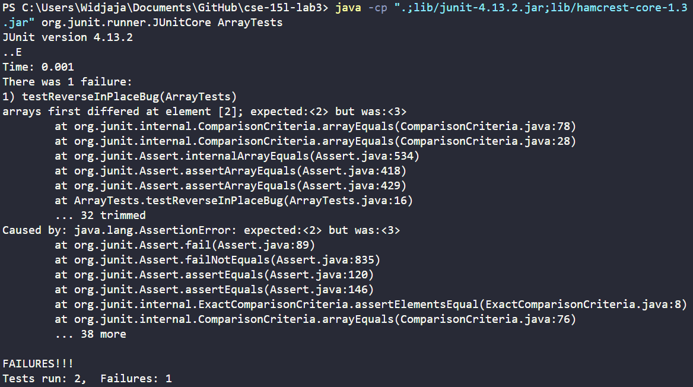
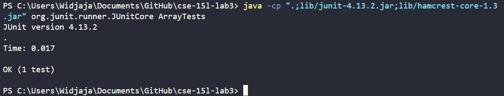

# Lab Report 23 
<a href="https://ucsd-cse15l-w24.github.io/week5/index.html#lab-report-3---bugs-and-commands-week-5" target="_blank">INSTRUCTIONS TO THIS LAB</a>

# Part 1 - Bugs  
In this lab (lab report 3), we choose one of the bugs from <a href="https://ucsd-cse15l-w24.github.io/week4/index.html#lab-tasks">week 4's lab</a> and we explore inputs that will return a failure-inducing input, a non-failure-inducing input, the symptom of said bug from both outputs, and the before-and-after code to showcase fixing said bug.
<br>

Here, I choose the first "reverseInPlace()" bug from <a href="https://ucsd-cse15l-w24.github.io/week4/index.html#lab-tasks">the week 4 lab</a>.

---

> Code block for the failure-inducing input as a JUnit test.
```java
@Test
public void testReverseInPlaceBug() {
	int[] input2 = { 1, 2, 3, 4 };
	ArrayExamples.reverseInPlace(input2);
	assertArrayEquals(new int[]{ 4, 3, 2, 1 }, input2);
}
```

> Code block for the non-failure-inducing input as a JUnit test.
```java
@Test 
public void testReverseInPlace() {
    int[] input1 = { 3 };
    ArrayExamples.reverseInPlace(input1);
    assertArrayEquals(new int[]{ 3 }, input1);
}
```

---

> Screenshots of the symptoms from using each test.  

> **Screenshot 1:** <br>


---

> **Screenshot 2:** <br>


---

> Code block before the code change.
```java
// Changes the input array to be in reversed order
static void reverseInPlace(int[] arr) {
	for(int i = 0; i < arr.length; i += 1) {
    	arr[i] = arr[arr.length - i - 1];
	}
}
```

> Code block after the code change.
```java
// Changes the input array to be in reversed order
static void reverseInPlace(int[] arr) {
	for(int i = 0; i < arr.length / 2; i += 1) {
    	int temp = arr[i];
    	arr[i] = arr[arr.length - i - 1];
    	arr[arr.length - i - 1] = temp;
    }
}
```
---

This fix addresses the issue where the function reverseInPlace() would forget about the element that is currently being iterated on, and it would also mirror the end array instead of reversing it. This is because we now store the element being iterated on in order to place it to the back of the array, and we also only iterate through half of the array in order to ensure no overlaps and that the array is reversed correctly instead of mirrored.

# Part 2 - Researching Commands
In this part of the lab, we choose between `less`, `find`, and `grep` in order to find 4 options or alternative ways to use the command we choose alongside 2 examples of using said option or alternative way in code blocks. Short descriptions are provided below the examples.  

Here, I chose `grep`. Sources used: https://www.geeksforgeeks.org/grep-command-in-unixlinux/  

## -c
`-c` : prints the number of lines containing the given pattern of characters to search for (geeksforgeeks)  

Two examples using the option:

```bash
1
[user@sahara ~]$ cd
[user@sahara ~]$ 

2
[user@sahara ~/lecture1]$ cd
[user@sahara ~]$ 

3
[user@sahara ~/lecture1/messages]$ cd 
[user@sahara ~]$ 
```
What it is doing. Why it is useful.

```bash
code block 2
```
What it is doing. Why it is useful.


## -n
`-n` : prints lines and line numbers if the line contains the pattern of characters given (geeksforgeeks)  

Two examples using the option:

```bash
1
[user@sahara ~]$ cd
[user@sahara ~]$ 

2
[user@sahara ~/lecture1]$ cd
[user@sahara ~]$ 

3
[user@sahara ~/lecture1/messages]$ cd 
[user@sahara ~]$ 
```
What it is doing. Why it is useful.

```bash
code block 2
```
What it is doing. Why it is useful.


## -B
`-B` : prints the line containing the pattern of characters to search for and n lines before it (geeksforgeeks)  
Usage is `-Bn` where `n` is the number of lines to print before the line with the pattern.

Two examples using the option:

```bash
1
[user@sahara ~]$ cd
[user@sahara ~]$ 

2
[user@sahara ~/lecture1]$ cd
[user@sahara ~]$ 

3
[user@sahara ~/lecture1/messages]$ cd 
[user@sahara ~]$ 
```
What it is doing. Why it is useful.

```bash
code block 2
```
What it is doing. Why it is useful.


## -R
`-R` : searches recursively in a directory for a pattern of characters and prints a given pattern of characters (geeksforgeeks)  

Two examples using the option:

```bash
1
[user@sahara ~]$ cd
[user@sahara ~]$ 

2
[user@sahara ~/lecture1]$ cd
[user@sahara ~]$ 

3
[user@sahara ~/lecture1/messages]$ cd 
[user@sahara ~]$ 
```
What it is doing. Why it is useful.

```bash
code block 2
```
What it is doing. Why it is useful.


# Part 3 - Jambo The Cat
