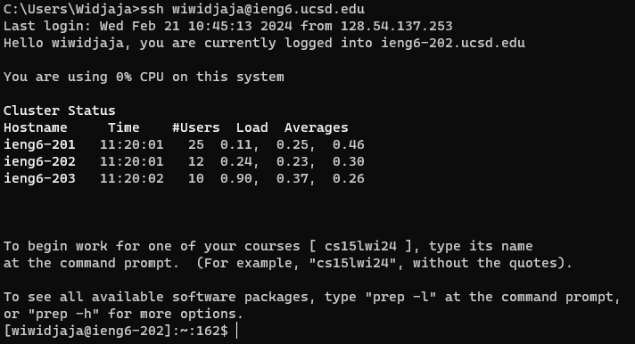
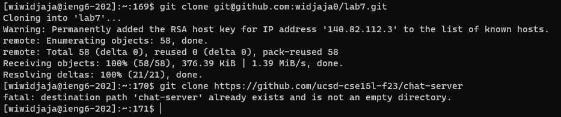
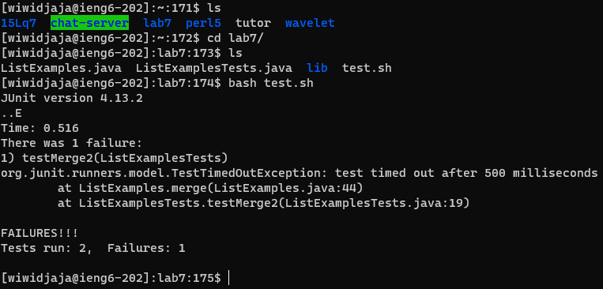
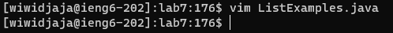
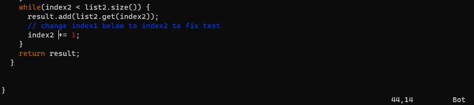
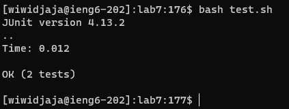
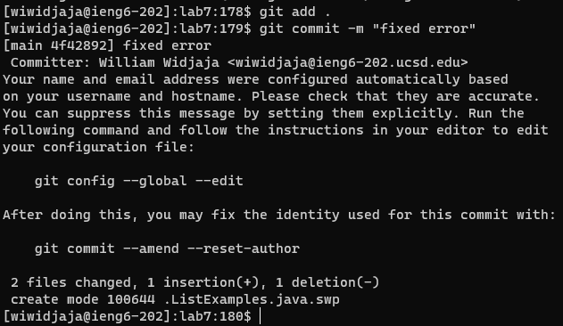

# Lab Report 4 
<a href="https://ucsd-cse15l-w24.github.io/week7/index.html#lab-report-4---vim-week-7" target="_blank">INSTRUCTIONS TO THIS LAB</a>

# Part 1 - Speeding up Command Line Tasks  
In this lab (lab report 4), we present our navigation throughout vim and the terminal in order to achieve command line proficiencies which may enable us to more efficiently navigate the terminal and vim.
<br>

## Step 4 - Log into ieng6

> **Screenshot:** <br>


Keys pressed:
```bash
<up> <up> <up> <enter>
```

The `ssh wiwidjaja@ieng6.ucsd.edu` command was 3 up in the search history, so I used up arrow to access it.

## Step 5 - Clone your fork of the repository from your Github account (using the SSH URL)

> **Screenshot:** <br>


Keys pressed:
```bash
<git clo> <tab> <ctrl-v> <enter>
```

The `git clone` command was easy to type so I just typed out `git clo` then pressed `tab` to autocomplete. Then I entered in the `ssh url` using `ctrl-v` to paste.

## Step 6 - Run the tests, demonstrating that they fail

> **Screenshot:** <br>


Keys pressed:
```bash
<ls>, <cd la> <tab> <enter>, <ls>, <bash tes> <tab> <enter>
```

I used `ls` in order to see what files or folders were in the current working directory that I was in by typing it out. To change my directory into the lab directory, I typed `cd la` then pressed `tab` to autocomplete. Then in the "lab7" directory, I entered in `bash tes` to get the `test.sh` file into the command using `tab` to autocomplete.

## Step 7 - Edit the code file to fix the failing test

> **Screenshot:** <br>



Keys pressed:
```bash
<vim L> <tab> <.> <tab> <enter>
In vim: <10j> <10j> <10j> <10j> <3j> <w> <w>, <i> <backspace> <backspace> <2> <space> <esc>, <:wq>
```

I first typed out `vim L` and then `tab` in order to grab the name of the java code, then pressed `.` and `tab` again to get the whole file name. Then in vim, I used `10j` four times in order to get to the error, and then I used `3j` to get to the specific line. I used `w` to get to the specific spot I wanted my cursor, and then I used `i` to insert. Once there, I used `backspace` twice and entered in `2` in order to change the text to `index2` and then pressed `space` and then `esc` in order to finish editing. Then I used `:wq` in order to save and exit the file.

## Step 8 - Run the tests, demonstrating that they now succeed

> **Screenshot:** <br>


Keys pressed:
```bash
<up> <up> <enter>
```

The `bash test.sh` command was 2 up in the command history so I just pressed the `up` arrow twice and then `enter`.

## Step 9 - Commit and push the resulting change to your Github account (you can pick any commit message!)

> **Screenshot:** <br>


Keys pressed:
```bash
<git a> <tab> <.> <enter>
<git com> <tab> <-m> <space> <"fixed error"> <enter>
```

I typed out `git a` and then pressed `tab` and then typed `.` and entered it in to add the changes to the repository. Then I typed out `git com` and `tab` to autocomplete it to `git commit ` and then `-m` to add a message and then I typed `"fixed error"` to state the message for the commit will be that we fixed an error. Then I entered the command in.

---

# Part 2 - Jambo The Cat
