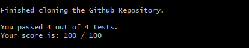

# Lab Report 5 
<a href="https://ucsd-cse15l-w24.github.io/week9/index.html#lab-report-5---putting-it-all-together-week-9" target="_blank">INSTRUCTIONS TO THIS LAB</a>

# Part 1 - Debugging Scenario  
In this lab (lab report 5), we simulate a scenario where we debug another student's code that produces an error in Java. We design a debugging scenario and we imagine a conversation on Edstem to write this report.
<br>

### 1 - The original post from a student.
  
Student: "When I am running my code through the autograder, I get an output that tells me that a test timed out. Does this mean that my code has an infinite loop somewhere??"  

### 2 - A response from the TA.
TA: "There seems to be multiple errors happening in your code. Have you tried checking that all variables (local or field) get incremented/decremented properly within your loops?"

### 3 - A response from the student.
  
Student: "I found the bug! It was that I was incrementing index1 instead of index2 in one of my while statements... but now I am getting a different bug! Can you help me out with this one? Is it because the public test case is wrong?"

### 4 - A second response from the TA.
TA: "I am looking at our implemenations again, and they seem to be correct for this PA. I looked at your code that you submitted and it looks like there is a misunderstanding in what the merge method is supposed to do which is causing the issue. Hint: If two of the same character/string appear in two different lists, do we still add both to the merged list or do we only add one of them?" 

### 5 - A second response from the student.
  
Student: "I found the bug! It was that I was not adding duplicates of characters in both lists to the merged list... but now I am getting another different bug! Can you help me out with this one? I suspect it has something to do with not properly clearing my static ArrayList that I created?"

### 4 - A third response from the TA.
TA: "Remember where static objects (especially when they are fields) are created in memory. Also something odd is going on with your add function that you call on your filtered ArrayList... should we prepend or append filtered values?"

### 5 - A final response from the student.
  
Student: "OHHHHH, I fixed it. Everything works! Thank you so much!"

### 6 - A final response from the TA.
TA: "Yeah of course, happy to help. Always remember that tutor and office hours are open for you to swing by whenever you need us."

## The setup for this scenario:
### The file and directory structure:
```
.
└── grader-review-widjaja0/
    ├── grading-area/
    │   ├── lib/
    │   │   ├── hamcrest-core-1.3.jar
    │   │   └── junit-4.13.2.jar
    │   ├── ExecExamples.class
    │   ├── ExecHelpers.class
    │   ├── IsA.class
    │   ├── IsMoon.class
    │   ├── ListExamples.class
    │   ├── ListExamples.java
    │   ├── test-output.txt
    │   ├── TestListExamples.class
    │   └── TestListExamples.java
    ├── lib/
    │   ├── hamcrest-core-1.3.jar
    │   └── junit-4.13.2.jar
    ├── student-submission/
    │   └── ListExamples.java
    ├── gitclone-output.txt
    ├── grade.sh
    ├── potential-copy-error.txt
    └── TestListExamples.java
└──list-examples-lab5
	└── ListExamples.java
```

### The contents of each file before each bug:  
Before bug 1:  
TestListExamples.java  
```java
import static org.junit.Assert.*;
import org.junit.*;
import java.util.Arrays;
import java.util.List;

class IsMoon implements StringChecker {
  public boolean checkString(String s) {
    return s.equalsIgnoreCase("moon");
  }
}

public class TestListExamples {
  @Test(timeout = 500)
  public void testFilterArgumentOrder() {
    StringChecker myStringChecker = new IsMoon();
    List<String> myList = Arrays.asList("a", "a", "b", "c", "d");
    List<String> emptyList = Arrays.asList();
    List<String> filtered = ListExamples.filter(myList, myStringChecker);
    assertEquals(emptyList, filtered);
  }

  @Test(timeout = 500)
  public void testMergeRightEnd() {
    List<String> left = Arrays.asList("a", "b", "c");
    List<String> right = Arrays.asList("a", "d");
    List<String> merged = ListExamples.merge(left, right);
    List<String> expected = Arrays.asList("a", "a", "b", "c", "d");
    assertEquals(expected, merged);
  }

  @Test(timeout = 500)
  public void testMergeLeftEnd() {
    List<String> left = Arrays.asList("a", "b", "d");
    List<String> right = Arrays.asList("a", "c");
    List<String> merged = ListExamples.merge(left, right);
    List<String> expected = Arrays.asList("a", "a", "b", "c", "d");
    assertEquals(expected, merged);
  }
}
```

ListExamples.java
```java
import java.util.ArrayList;
import java.util.List;

interface StringChecker { boolean checkString(String s); }

class ListExamples {

  static List<String> result = new ArrayList<>();
  // Returns a new list that has all the elements of the input list for which
  // the StringChecker returns true, and not the elements that return false, in
  // the same order they appeared in the input list;
  static List<String> filter(List<String> list, StringChecker sc) {
    if(list.size() == 0) { return list; }
	result.clear();
    List<String> result = new ArrayList<>();
    for(String s: list) {
      if(sc.checkString(s)) {
        result.add(0, s);
      }
    }
    return result;
  }


  // Takes two sorted list of strings (so "a" appears before "b" and so on),
  // and return a new list that has all the strings in both list in sorted order.
  static List<String> merge(List<String> list1, List<String> list2) {
    List<String> result = new ArrayList<>();
    int index1 = 0, index2 = 0;
    while(index1 < list1.size() && index2 < list2.size()) {
      int compared = list1.get(index1).compareTo(list2.get(index2));
      if(compared == 0) {
        result.add(list1.get(index1));
        index1 += 1;
        index2 += 1;
      }
      else if(compared < 0) {
        result.add(list1.get(index1));
        index1 += 1;
      }
      else {
        result.add(list2.get(index2));
        index2 += 1;
      }
    }
    while(index1 < list1.size()) {
      result.add(list1.get(index1));
      index1 += 1;
    }
    while(index2 < list2.size()) {
      result.add(list2.get(index2));
      index1 += 1;
    }
    return result;
  }
}
```

Before bug 2:  
TestListExamples.java  
*Same as above.*  

ListExamples.java  
```java
import java.util.ArrayList;
import java.util.List;

interface StringChecker { boolean checkString(String s); }

class ListExamples {

  static List<String> result = new ArrayList<>();
  // Returns a new list that has all the elements of the input list for which
  // the StringChecker returns true, and not the elements that return false, in
  // the same order they appeared in the input list;
  static List<String> filter(List<String> list, StringChecker sc) {
    if(list.size() == 0) { return list; }
	result.clear();
    List<String> result = new ArrayList<>();
    for(String s: list) {
      if(sc.checkString(s)) {
        result.add(0, s);
      }
    }
    return result;
  }


  // Takes two sorted list of strings (so "a" appears before "b" and so on),
  // and return a new list that has all the strings in both list in sorted order.
  static List<String> merge(List<String> list1, List<String> list2) {
    List<String> result = new ArrayList<>();
    int index1 = 0, index2 = 0;
    while(index1 < list1.size() && index2 < list2.size()) {
      int compared = list1.get(index1).compareTo(list2.get(index2));
      if(compared == 0) {
        result.add(list1.get(index1));
        index1 += 1;
        index2 += 1;
      }
      else if(compared < 0) {
        result.add(list1.get(index1));
        index1 += 1;
      }
      else {
        result.add(list2.get(index2));
        index2 += 1;
      }
    }
    while(index1 < list1.size()) {
      result.add(list1.get(index1));
      index1 += 1;
    }
    while(index2 < list2.size()) {
      result.add(list2.get(index2));
      index2 += 1;
    }
    return result;
  }
}
```

Before bug 3:  
TestListExamples.java  
```java
import static org.junit.Assert.*;
import org.junit.*;
import java.util.Arrays;
import java.util.List;

class IsMoon implements StringChecker {
  public boolean checkString(String s) {
    return s.equalsIgnoreCase("moon");
  }
}

class IsA implements StringChecker {
  public boolean checkString(String s) {
    return s.equalsIgnoreCase("a");
  }
}

public class TestListExamples {
  @Test(timeout = 500)
  public void testFilterArgumentOrder() {
    StringChecker myStringChecker = new IsMoon();
    List<String> myList = Arrays.asList("a", "a", "b", "c", "d");
    List<String> emptyList = Arrays.asList();
    List<String> filtered = ListExamples.filter(myList, myStringChecker);
    assertEquals(emptyList, filtered);
  }

  @Test(timeout = 500)
  public void testFilter() {
    StringChecker myStringCheckerA = new IsA();
    List<String> myList = Arrays.asList("a", "a", "b", "c", "d");
    List<String> anotherList = Arrays.asList("a", "a", "a");
    List<String> aList = Arrays.asList("a", "a");
    List<String> bList = Arrays.asList("a", "a", "a");
    List<String> filtered1 = ListExamples.filter(myList, myStringCheckerA);
    List<String> filtered2 = ListExamples.filter(anotherList, myStringCheckerA);
    assertSame(filtered1.size(), 2);
    assertSame(filtered2.size(), 3);
    assertEquals(aList, filtered1);
    assertEquals(bList, filtered2);
  }

  @Test(timeout = 500)
  public void testMergeRightEnd() {
    List<String> left = Arrays.asList("a", "b", "c");
    List<String> right = Arrays.asList("a", "d");
    List<String> merged = ListExamples.merge(left, right);
    List<String> expected = Arrays.asList("a", "a", "b", "c", "d");
    assertEquals(expected, merged);
  }

  @Test(timeout = 500)
  public void testMergeLeftEnd() {
    List<String> left = Arrays.asList("a", "b", "d");
    List<String> right = Arrays.asList("a", "c");
    List<String> merged = ListExamples.merge(left, right);
    List<String> expected = Arrays.asList("a", "a", "b", "c", "d");
    assertEquals(expected, merged);
  }
}
```
ListExamples.java
```java
import java.util.ArrayList;
import java.util.List;

interface StringChecker { boolean checkString(String s); }

class ListExamples {

  static List<String> result = new ArrayList<>();
  // Returns a new list that has all the elements of the input list for which
  // the StringChecker returns true, and not the elements that return false, in
  // the same order they appeared in the input list;
  static List<String> filter(List<String> list, StringChecker sc) {
    if(list.size() == 0) { return list; }
	result.clear();
    List<String> result = new ArrayList<>();
    for(String s: list) {
      if(sc.checkString(s)) {
        result.add(0, s);
      }
    }
    return result;
  }


  // Takes two sorted list of strings (so "a" appears before "b" and so on),
  // and return a new list that has all the strings in both list in sorted order.
  static List<String> merge(List<String> list1, List<String> list2) {
    List<String> result = new ArrayList<>();
    int index1 = 0, index2 = 0;
    while(index1 < list1.size() && index2 < list2.size()) {
      int compared = list1.get(index1).compareTo(list2.get(index2));
      if(compared < 0) {
        result.add(list1.get(index1));
        index1 += 1;
      }
      else {
        result.add(list2.get(index2));
        index2 += 1;
      }
    }
    while(index1 < list1.size()) {
      result.add(list1.get(index1));
      index1 += 1;
    }
    while(index2 < list2.size()) {
      result.add(list2.get(index2));
      index2 += 1;
    }
    return result;
  }
}
```

### Full command lines ran to trigger the bugs:  
Ran the command below multiple times.  
`bash grade.sh https://github.com/widjaja0/list-examples-lab5.git`
```bash
# ---------------------- SETUP ----------------------

unameOut="$(uname -s)"
case "${unameOut}" in
    Linux*)     machine=Linux;;
    Darwin*)    machine=Mac;;
    CYGWIN*)    machine=Cygwin;;
    MINGW*)     machine=MinGw;;
    MSYS_NT*)   machine=Git;;
    *)          machine="UNKNOWN:${unameOut}"
esac

# VARIABLES
# the relative path of JUNIT files
if [[ ${machine} == "MinGw" ]]
then
	CPATH='.;lib/hamcrest-core-1.3.jar;lib/junit-4.13.2.jar'
else
	CPATH='.:lib/hamcrest-core-1.3.jar:lib/junit-4.13.2.jar'
fi
# borders
BORDER='----------------------'

# remove folders to make fresh grading files/folders
rm -rf student-submission
rm -rf grading-area

# make a new grading-area
mkdir grading-area

# clone the student's repository into student-submission
git clone $1 student-submission 2> gitclone-output.txt

# checks if the url was invalid
if [[ $? -ne 0 ]]
then
	echo "$BORDER"
	echo "Invalid URL."
	echo "Score: 0"
	echo "$BORDER"
	exit 1
fi

echo "$BORDER"
echo 'Finished cloning the Github Repository.'
echo "$BORDER"

# copy all the root java files into the grading-area
# recursively copy all the JUNIT files into the grading-area
# attempts to copy the student's submission for ListExamples.java into the grading-area

cp *.java grading-area
cp -r lib grading-area
cp student-submission/ListExamples.java grading-area 2> potential-copy-error.txt

# change working directory into the grading-area
cd grading-area

# ---------------------- GRADING ----------------------

# the ListExamples.java file does not exist in the grading area, the student did not name their file correctly
# give them a 0
if ! [ -f ListExamples.java ]
then
	echo "Missing ListExamples.java in student submission! Check that you have submitted ListExamples.java with the proper file path or file naming convention."
	echo "Score: 0"
	echo "$BORDER"
	exit 1
fi

# attempt to compile all the java files and parse the JUNIT library to enable tester files to work
javac -cp $CPATH *.java

# the previous compile command returned an error
# give them a 0
if [[ $? -ne 0 ]]
then
	echo "$BORDER"
	echo "One of your files has a COMPILE TIME ERROR! Refer to the error message above for more details."
	echo "Score: 0"
	echo "$BORDER"
	exit 1
fi

# attempt to run testers against their code
java -cp $CPATH org.junit.runner.JUnitCore TestListExamples > test-output.txt

# if any of their tests failed
if [[ $? -ne 0 ]]
then
	# --------- PARTIAL OR NO PASS ---------
	# grab the error output of the tester from test-output.txt
	ERRORS=$(cat test-output.txt | head -n 6)
	echo "JUNIT OUTPUT:"
	echo ""
	echo -e "$ERRORS"
	echo "$BORDER"

	# grab the tests run / failures output of the tester from test-output.txt
	# TESTSRUN = number of tests run
	# FAILURES = number of failures
	TESTOUT=$(cat test-output.txt | tail -n 2 | head -n 1)
	TESTSRUN=$(echo $TESTOUT | awk -F[', '] '{print $3}')
	NUMFAILED=$(echo $TESTOUT | awk -F[', '] '{print $6}')

	# get their score from NUMPASSED divided by the number of TESTSRUN
	NUMPASSED=$(( TESTSRUN - NUMFAILED ))
	SCORE=$(( (NUMPASSED * 100) / TESTSRUN ))

	# print their score
	echo 'You passed' $NUMPASSED 'out of' $TESTSRUN 'tests.'
	echo 'Your score is:' $SCORE '/ 100'
	echo "$BORDER"
else
	# --------- FULL PASS ---------
	# get their score from the number of tests run
	TESTOUT=$(cat test-output.txt | tail -n 2 | head -n 1)
	TESTSPASSED=$(echo $TESTOUT | awk -F'[()]' '{print $2}' | cut -d' ' -f1)

	# print their score
	echo 'You passed' $TESTSPASSED 'out of' $TESTSPASSED 'tests.'
	echo 'Your score is: 100 / 100'
	echo "$BORDER"
fi
```

### Descriptions of what to edit to fix the bugs:  
Bug 1:
Change index2 to index1 in ListExamples.java:merge so that index2 increments correctly.

Bug 2:
Delete the if comparison that compares if the character from list1 = the character from list2 so it is able to add both characters from both lists even if they equal each other.

Bug 3:
Instantiate the ArrayList for filter in the method instead of in a static field. Also change the .add() method on the filtered ArrayList from .add(0, ...) to just .add(...) in order to append to the filtered list properly.

---

# Part 2 - Reflection
Finally, to reflect on our lab reports, one thing I would say I have learned from my lab experience in the second half of this quarter that I did not know before was how we can use jdb to debug code in order to figure out the state of local variables and to figure out how or why some code can be stuck in an infinite loop. Another thing that I have learned from lab that I did not previously know before was that the terminal does not handle floating point values, but if you are running a Unix terminal, you can just use the `bc` command to handle this. However, if you are not on a Unix system and are using MingGW or some other windows system, I learned that you have to install msys2 in order to be able to access the command which I thought was a cool thing to learn from StackOverflow. I think the coolest thing that I have learned so far was being able to use a ProcessBuilder to run bash commands right within your Java program.

---

# Part 3 - Jambo The Cat
